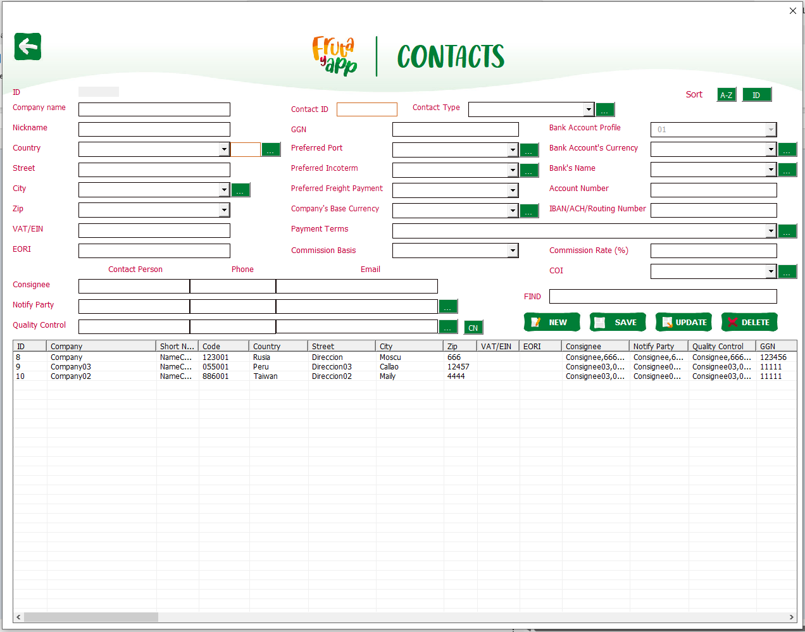
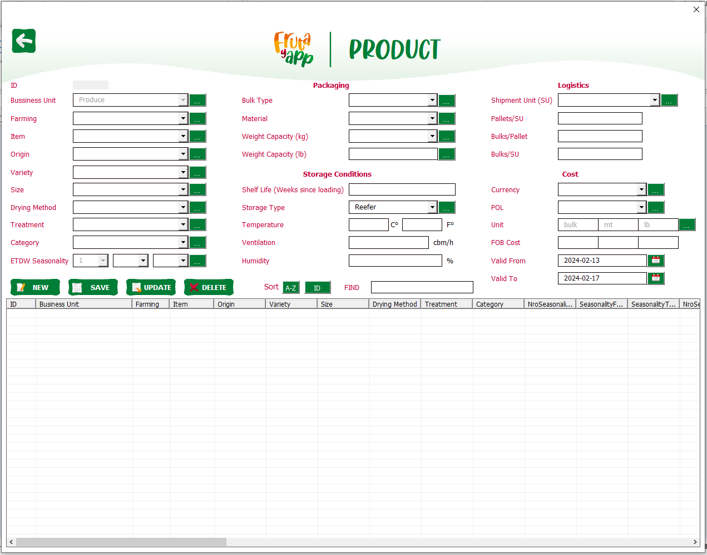
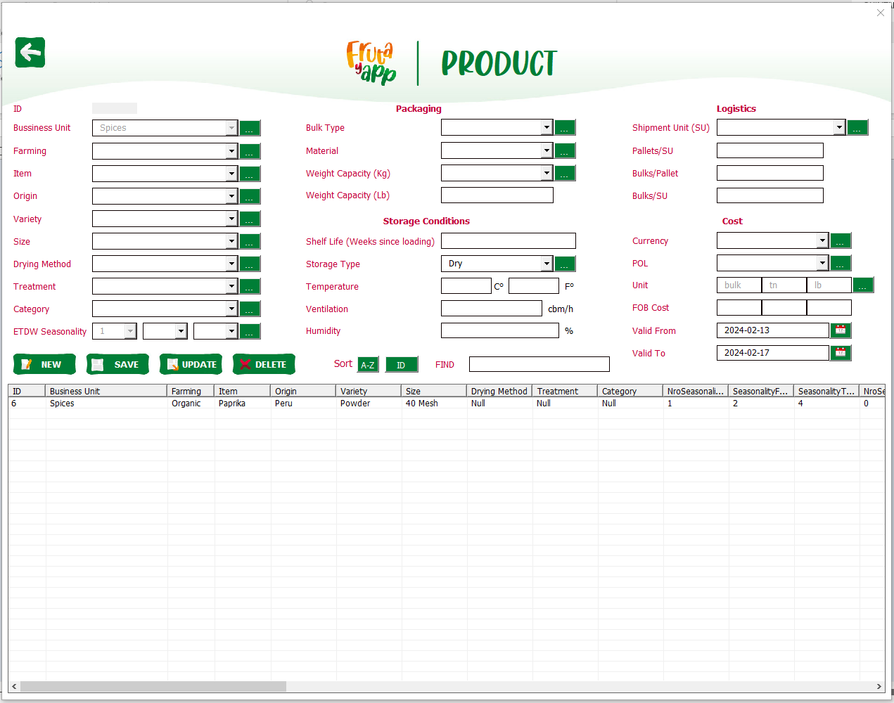
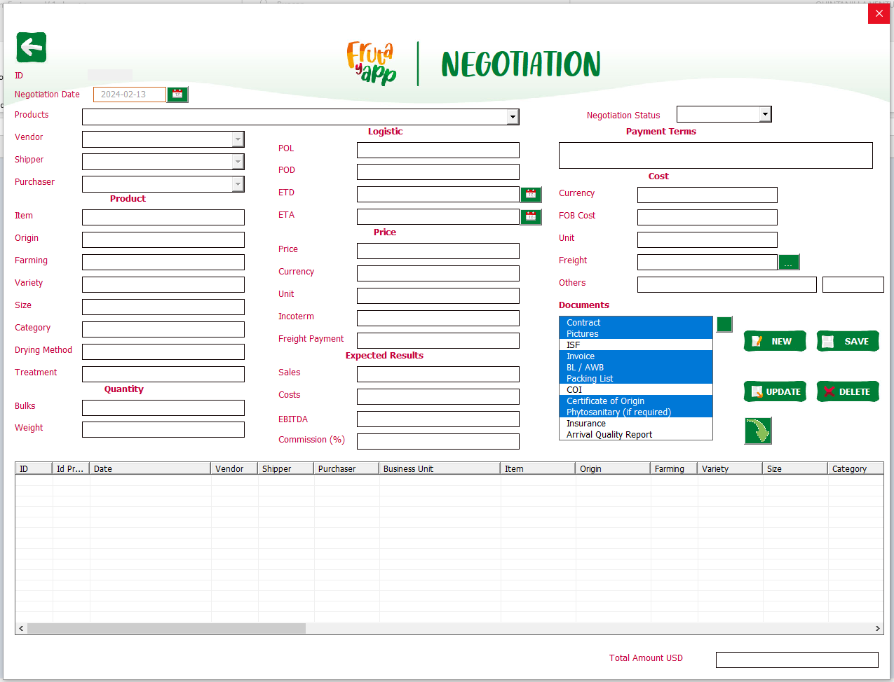
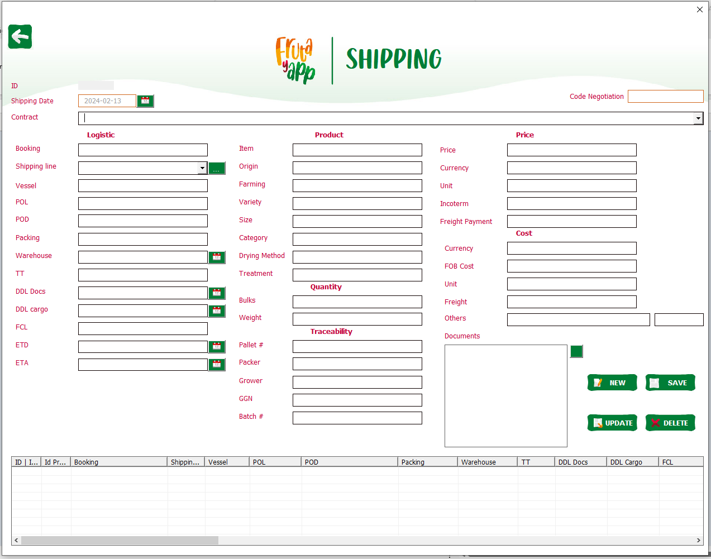
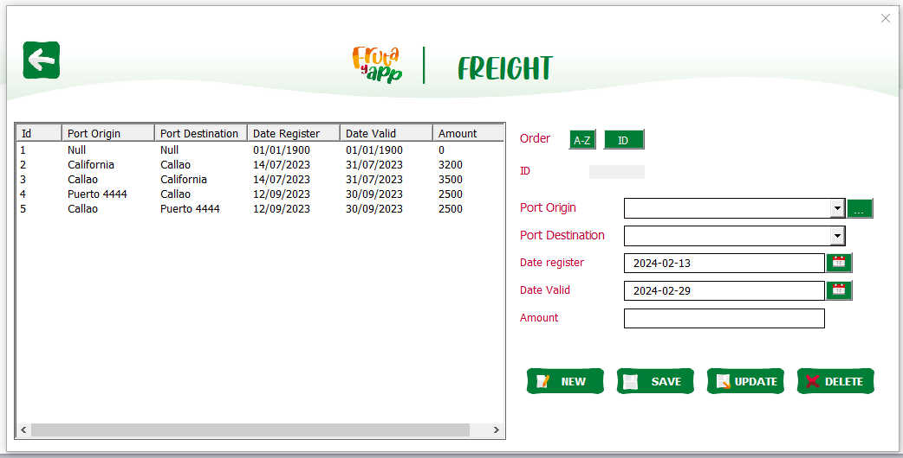
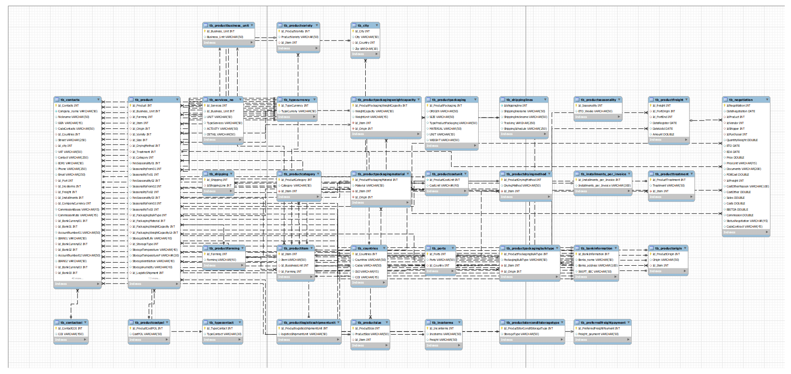

# CRM Frutayapp

---
## 1. About

El presente repositorio cumple con el fin mostrar mis trabajos realizados, por ello solo muestro imagenes (ventanas y esquema de base de datis) y texto descriptivo del mismo, y mas no el codigo por temas de confidencialidad. 

Software hecho en VBA con base de datos en MySQL, para el control de productos desde el lugar de produccion - transporte - embarque y entrega.

---

## 2. Home
- Pagina principal *Home* con acceso a las diferentes secciones del proyecto.

---
## 3. Contacts
- Seccion *Contacts* en donde se muestra información de contacto.

---
## 4. Products
- Seccion *Products* en donde se muestra información de productos de tipo ***Produce***.

- Seccion *Products* en donde se muestra información de productos de tipo ***Spices***.

---
## 5. Negotiation
- Seccion *Negotiation* en donde se registra la primera etapa de la negociación.

---
## 6. Shipping
- Seccion *Shipping* en donde se registra el envio de los productos.

---
## 7. Freight
- Seccion *Freight* en donde se registra el transportes para los productos.

## 8. Diagrama de la base de datos
- Base de datos hecho en MySQL, a continuacion semuestra el diagrama de la base de datos.

