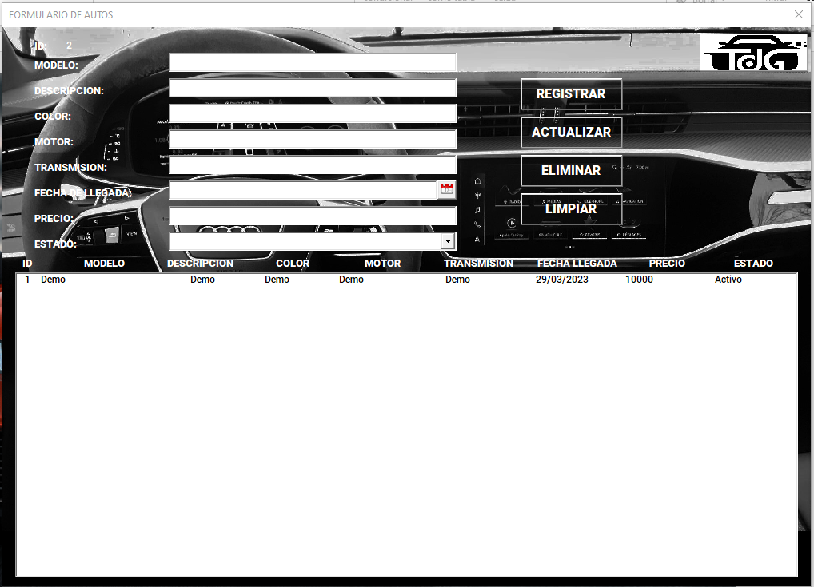
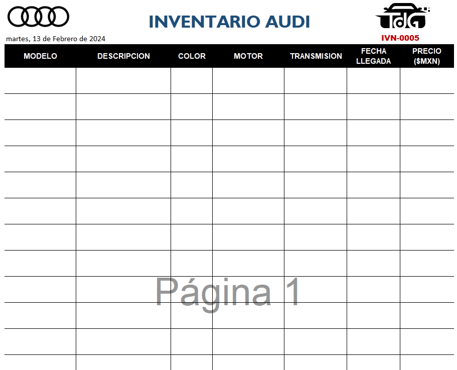
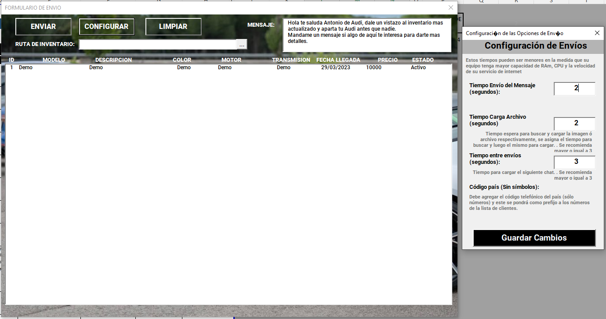
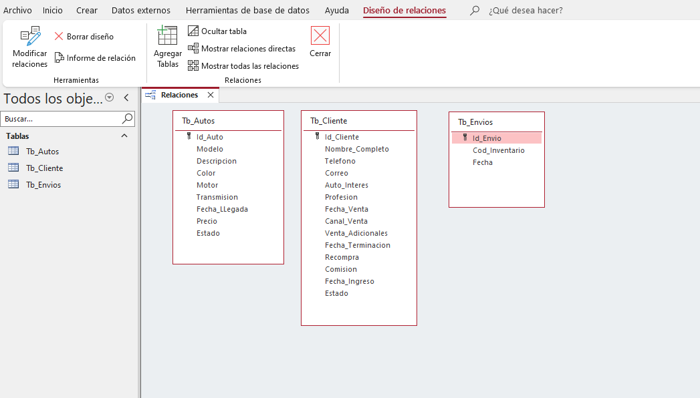

# Sistema gestor de inventario de autos - Audi

  

---
## 1. About

El presente repositorio cumple con el fin mostrar mis trabajos realizados, por ello solo muestro imagenes (ventanas y esquema de base de datos) y texto descriptivo del mismo, y mas no el código por temas de confidencialidad. 

Software hecho en VBA con base de datos en Access, para el control de inventarios de autos Audi, para luego enviar el reporte del inventario a los clientes mediante Whatsapp (envio directo desde VBA).

---

## 2. Home
- Pagina principal *Home* con acceso a las diferentes secciones del proyecto.

---
## 3. Autos
- Seccion *Autos* en donde se muestra información de los autos Audi.

---
## 4. Plantilla de envio
- Seccion *plantilla* del cual se llena para antes del envio.

---
## 5. Envio
- Seccion *Envio* en donde se personaliza el mensaje, tiempo de demora para el envio, tiempo de carga del pdf, todo esto se envia directamente al whatsapp del cliente (Whatsapp desktop).

---

## 6. Diagrama de la base de datos
- Base de datos hecho en Access, a continuacion semuestra el diagrama de la base de datos.

