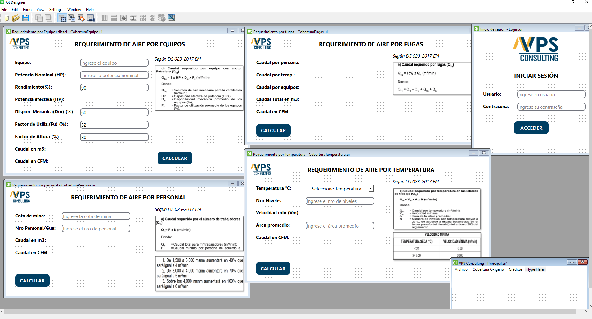
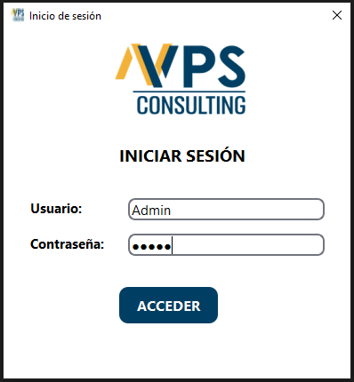
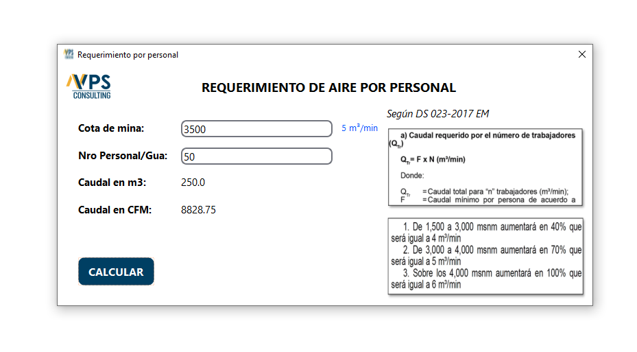
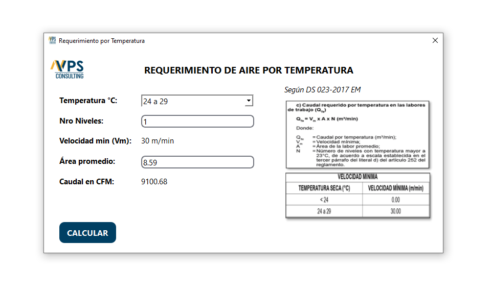
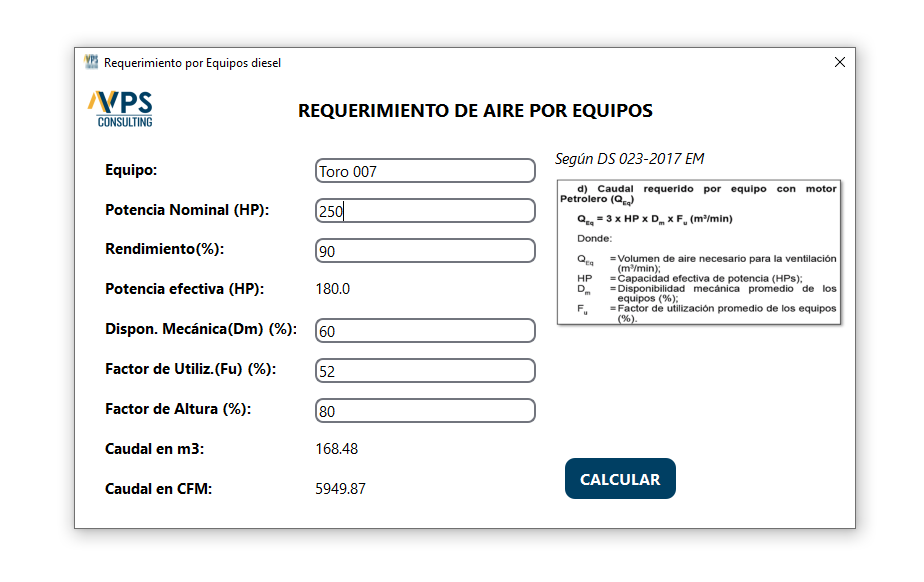

# Sistema Geotecnico / JR Geoconsultores

  

---
## 1. About

El presente repositorio cumple con el fin mostrar mis trabajos realizados, por ello solo muestro imagenes (ventanas y esquema de base de datos) y texto descriptivo del mismo, y mas no el código por temas de confidencialidad. 

Software hecho en Python, con base de datos SQLite, para el calculo de cobertura de una mina en base a parametros dichos en el DS 023-2017 EM.

---

## 2. Home
- Pagina principal *Home* con acceso a las diferentes secciones del proyecto.

---
## 3. Inicio de un proyecto
- Seccion *Inicio* en donde se da los primeros parametros para el inicio de los ensayos.

---
## 4. Ensayos estandar
- Seccion *Ensayos estandar* del cual se inicia un estudio de mecanica de suelos.

---
## 5. Metodo A y B para clasificacion de suelos
- Seccion *Envio* en donde se personaliza el mensaje, tiempo de demora para el envio, tiempo de carga del pdf, todo esto se envia directamente al whatsapp del cliente (Whatsapp desktop).

---

## 6. Todas las hojas de calculo que contiene
- Todas las hojas de calculo que se crearon cumpliendo cada una de la normativas.

## 7. Automatizacion de dibujo en CAD
- Automatizacion de dibujo en CAD, a partir de un resumen de calicatas.

