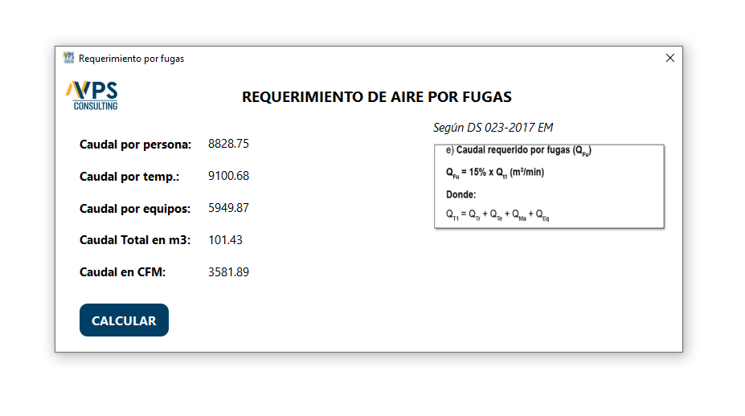

# Software Ventilación / VPS Consulting

  

---
## 1. About

El presente repositorio cumple con el fin mostrar mis trabajos realizados, por ello solo muestro imagenes (ventanas y esquema de base de datos) y texto descriptivo del mismo, y mas no el código por temas de confidencialidad. 

Software hecho en Python, con base de datos SQLite, para el calculo de cobertura de una mina en base a parametros dichos en el DS 023-2017 EM.

  

---

## 2. Login
- Pagina *Login* para el control de acceso.

---
## 3. Panel inicial
- Seccion *Principal* en donde se muestran los menus de los acessos.

---
## 4. Requerimiento por personal
- Seccion *Requerimiento por personal* del cual se determina en base a la cota de la mina el caudal minimo por persona y ademas se debe de ingresar el numero de personas por guardia para luego calcular el requerimiento por persona.

---
## 5. Requerimiento por altas temperaturas
- Seccion *Requerimiento por temperatura* del cual se determina en base a labores que tengan Temperaturas superiores a 24 °C y la seccion promedio de estas labores.

---

## 6. Requerimiento por Equipos Diesel
- Seccion *Requerimiento por Equipos Diesel* del cual se determina en base a la potencia nominal del equipo, rendimiento, disponibilidad mecanica, factor de utilizacion y factor de altura.

---

## 7. Requerimiento por fugas
- Seccion *Requerimiento por Fugas* del cual se determina en base a la suma de los requerimientos anteriores multiplicado por 15%.

##### CONTINUARA ...